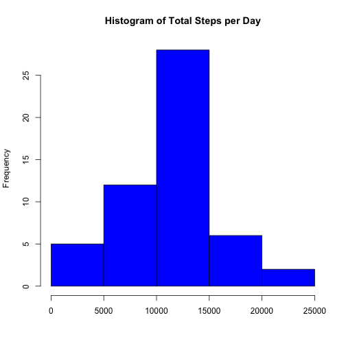
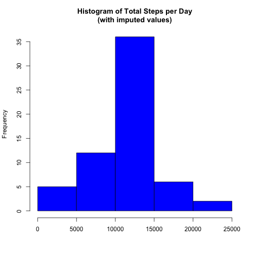
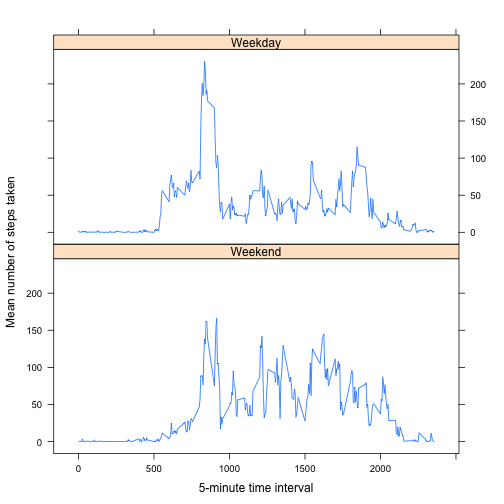

# Reproducible Research: Peer Assessment 1


## Loading and preprocessing the data


```r
# Load data into R.
dataset <- read.csv(unz("activity.zip", "activity.csv"), header = TRUE, sep = ",")

# Restructure dataset so that each row is a day.
dailyDataset <- ddply(dataset, .(date), summarise,
                    steps.total = sum(steps))

# Restructure dataset so that each row is a 5-minute time interval.
intDataset <- ddply(dataset, .(interval), summarise,
                    steps.mean = mean(steps, na.rm = TRUE),
                    steps.total = sum(steps, na.rm = TRUE))
```


## What is the mean total number of steps taken per day?

Histogram of total number of steps taken per day:


```r
# Create histogram.
hist(dailyDataset$steps.total, col = "blue", 
     main = "Histogram of Total Steps per Day", xlab = "")
```

 


```r
# Calculate mean and median number of steps
meanSteps <- as.numeric(mean(dailyDataset$steps.total, na.rm = TRUE))
medianSteps <- median(dailyDataset$steps.total, na.rm = TRUE)
```

The mean number of steps taken per day is 10766.19 and the median number 
of steps taken per day is 10765.


## What is the average daily activity pattern?


```r
# Create time series plot of mean steps taken, by time interval.
plot(intDataset$interval, intDataset$steps.mean, xlab = "Interval", 
     ylab = "Mean Number of Steps", type = "l")
```

 

```r
# Calculate interval with maximum average number of steps.
maxTotalSteps <- max(intDataset$steps.mean, na.rm = TRUE)
intervalMax <- intDataset$interval[which.max(intDataset$steps.mean)]
```

On average across all the days in the dataset, the interval 835
contains the maximum number of steps.


## Imputing missing values


```r
# Calculate number of missing values.
steps.missing <- sum(is.na(dataset$steps))
# Create duplicate of original dataset for imputing missing values.
datasetImpute <- dataset
# Impute missing step values for original dataset.
datasetImpute <- merge(datasetImpute, intDataset, by = "interval", all.x = TRUE,
                       all.y = FALSE)
datasetImpute$steps.imputed <- datasetImpute$steps
datasetImpute$steps.imputed[is.na(datasetImpute$steps.imputed)] <- 
  round(datasetImpute$steps.mean[is.na(datasetImpute$steps.imputed)], digits = 0)
```

There are 2304 missing step values.


Strategy for imputing missing data:

Missing step values were replaced with the rounded value of mean steps taken for
a given 5-minute interval.


```r
# Restructure dataset so that each row is a day.
dailyDatasetImpute <- ddply(datasetImpute, .(date), summarise,
                    steps.total = sum(steps.imputed))
# Create histogram.
hist(dailyDatasetImpute$steps.total, col = "blue", 
     main = "Histogram of Total Steps per Day\n(with imputed values)", xlab = "")
```

 

```r
# Calculate mean and median number of steps
meanStepsImpute <- as.numeric(mean(dailyDatasetImpute$steps.total, na.rm = TRUE))
medianStepsImpute <- as.numeric(median(dailyDatasetImpute$steps.total, na.rm = TRUE))
```

With imputed values for number of steps taken, the mean number of steps taken
per day is 10765.64 and the median number of steps taken per day is
10762.
These values do not differ much from the previously calculated values. With
imputed values, the mean decreased by 0.6, while the median decreased by 3.
Imputing missing data increased the frequency at which a given total number of
steps per day occurred in the dataset, but had little effect on the overall
distribution of total steps taken per day.

## Are there differences in activity patterns between weekdays and weekends?


```r
# Create factor variable indicating weekday vs. weekend.
datasetImpute$weekday <- weekdays(as.Date(datasetImpute$date))
datasetImpute$weekdayFactor[datasetImpute$weekday == "Sunday" |
                              datasetImpute$weekday == "Saturday"] <- 0
datasetImpute$weekdayFactor[datasetImpute$weekday == "Monday" |
                              datasetImpute$weekday == "Tuesday" |
                              datasetImpute$weekday == "Wednesday" |
                              datasetImpute$weekday == "Thursday" |
                              datasetImpute$weekday == "Friday"] <- 1
datasetImpute$weekdayFactor <- factor(datasetImpute$weekdayFactor, labels =
                                        c("Weekend", "Weekday"))
# Restructure dataset so that each row is a 5-minute time interval, by weekday
#   vs. weekend.
intDatasetImpute <- ddply(datasetImpute, .(interval, weekdayFactor), summarise,
                    steps.mean = mean(steps.imputed, na.rm = TRUE),
                    steps.total = sum(steps.imputed, na.rm = TRUE))
# Create panel chart.
xyplot(steps.mean ~ interval | weekdayFactor, data = intDatasetImpute,
       type = "l", layout = c(1, 2), xlab = "5-minute time interval",
       ylab = "Mean number of steps taken")
```

 
